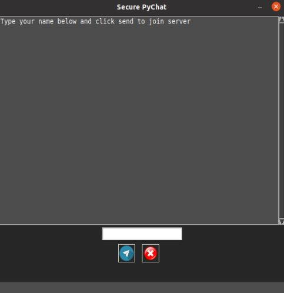

# PROJECT #3 UCSD FULLSTACK COURSE 2021 | cybr504-encrypted-im

Project Members: Jessica Eyerman, Tony Park, Hayden Lawson, Peiyin Tsay  
Project Team Name: Iron Wolf Cybersecurity CYBR504 USD MS CSE  
Project name and Summary: SecurePyChat - A end-to-end Encrypted Chat Program in Python  

Heroku Link to Site: [to be added in future edition]

# Table of Contents

- [Screenshots](#screenshots)
- [Coding-Requirements-Hit](#Project Requirements Hit)
- [Technologies-Used](#Technologies-Used)
- [Credits](#Credits)

# Screenshots:

1. Screenshot of App 1
    
   

2. Screenshot of App 2
    
   

3. Screenshot of App 3
    
   

4. Screenshot of App 4
    
   

## Project Requirements Hit

[x] Must use ReactJS in some way (even if minimal)  
[x] Must use a Node and Express Web Server  
[x] Must be backed by a MySQL or MongoDB Database with a Sequelize or Mongoose ORM  
[x] Must have both GET and POST routes for retrieving and adding new data  
[x] Must be deployed using Heroku (with Data)  
[x] Must utilize at least two libraries, packages, or technologies that we haven't discussed  
[x] Must allow for or involve the authentication of users in some way  
[x] Must have a polished frontend/UI  
[x] Must have folder structure that meets MVC Paradigm  
[x] Must meet good quality coding standards (indentation, scoping, naming)  
[x] Must not expose sensitive API key information on the server  

## Technologies-Used

Requirements.txt Packages

- click==8.1.2  
- Flask==2.1.1  
- gunicorn==20.1.0  
- importlib-metadata==4.11.3  
- itsdangerous==2.1.2  
- Jinja2==3.1.1  
- MarkupSafe=2.1.1  
- Werkzeug==2.1.1  
- zipp==3.8.0  
     

## Credits

- Chaturvedi, S. (2017, November 22). Let's write a chat app in python. Retrieved from https://medium.com/swlh/lets-write-a-chat-app-in-python-f6783a9ac170

- Chaturvedi, S. [@schedutron] (2018). chat_clnt.py [source code]. Retrieved from https://gist.github.com/schedutron/287324944d765ae0656eec6971ca40d8

- Chaturvedi, S. [@schedutron] (2018). chat_serv.py [source code]. Retrieved from https://gist.github.com/schedutron/cd925247bfc4f8ae7930bbd99984a441

- Elder, J. [@Codemy.com] (2022). Python GUIs with Tkinter. Retrieved from Youtube: https://youtube.com/playlist?list=PLCC34OHNcOtoC6GglhF3ncJ5rLwQrLGnV

- Sweigart, A. (2018). Cracking codes with pythons: An introduction to building and breaking ciphers. San Francisco: No Starch Press.

© Iron Wolf Cybersecurity Team 2022
Tony Park Jessica Eyerman Hayden Lawson Peiyin Tsay
